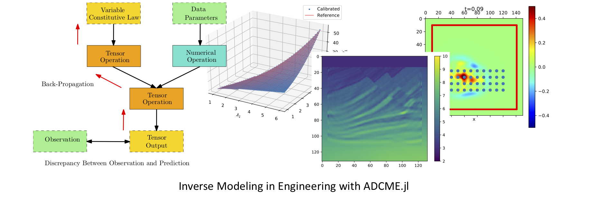

# ADCME.jl




The ADCME library (**A**utomatic **D**ifferentiation Library for **C**omputational and **M**athematical **E**ngineering) is written to facilitate scalable and sophisticated scientific computing that requires the evaluation of gradients by leveraging the power of [TensorFlow](https://www.tensorflow.org/) and [PyTorch](https://pytorch.org/). It is particularly dedicated to the inverse modeling problem, with the ultimate goal -- _Once the forward simulation is implemented, the researcher should be able to do the inverse modeling without substantial effort._

Several features of the library are

* Simple and neat Julia syntax (MATLAB-style). Most of the arithmetic operators are overloaded into Python TensorFlow, which indicates that users will obtain the static graph performance of TensorFlow and do not need to worry about the overhead of scripting in Julia. In addition, since operators are overloaded, users can write Julia-style codes, e.g., one can use `A*B` for matrix production instead of `tf.matmul(A,B)`.

* Custom operators are supported. Users can implement their own operators for the bottleneck operations such as those that are difficult to vectorize in TensorFlow. When implementing custom operators, `ADCME.jl` provides access to the `ATen` library in `PyTorch`, which is equipped with automatic differentiation. This further reduces users' effort to do inverse modeling.

* Static graphs. Static computation graphs are used instead of dynamic graphs. This is a key difference between machine learning and scientific computing. In scientific computing, computation graph optimization _does_ matter. One such example is `while_loop`, where in scientific computing, large numbers of iterations are common and direct implementation results in a large computation graph. Another example is the parallelism of different operators.

The introductory [blog](https://medium.com/@kailaix16/introduction-to-adcme-jl-an-inverse-modeling-library-for-scientific-computing-76e56b2bcb49) is also available.

# Installation

1. Install [Julia](https://www.tensorflow.org/)

2. Install [TensorFlow](https://www.tensorflow.org/). Please install `1.14` instead of `2.0` since in `2.0`, dynamic graphs are the default. 

3. Install `ADCME.jl`
```
julia> ]
pkg> add ADCME
```

4. Check the PyCall Python version is consistent with the `TensorFlow`. To check the PyCall Python version, 
```
julia> using PyCall
julia> PyCall.libpython 
```
The output should be something similar to `/anaconda3/envs/py36/lib/libpython3.6m.dylib`. If the PyCall Python version is different from `TensorFlow` python version, type
```
julia> ENV["PYTHON"] = <the python location above>
julia> ]
pkg> build PyCall
```

5. (Optional) Test `ADCME.jl`
```
julia> ]
pkg> test ADCME
```

7. (Optional) Additional Test

If you want to use `customop()` and test the utility, test with the following command
```
julia> test_customop()
```
If it fails, it is probably the `tensorflow, python, gcc` configuration is not compatible. The following configurations were partially tested

* Linux: GCC==4.8, Anaconda Python==3.6, TensorFlow==1.14

* Mac: Homebrew GCC==8.3, Anaconda Python==3.6, TensorFlow==1.14


# Tutorial

Consider solving the following problem

-bu''(x)+u(x) = f(x), x∈[0,1], u(0)=u(1)=0

where 

f(x) = 8 + 4x - 4x²

Assume that we have observed `u(0.5)=1`, we want to estimate `b`. The true value in this case should be `b=1`.

```julia
using LinearAlgebra
using ADCME

n = 101 # number of grid nodes in [0,1]
h = 1/(n-1)
x = LinRange(0,1,n)[2:end-1]

b = Variable(10.0) # create a Variable for `b`
A = diagm(0=>2/h^2*ones(n-2), -1=>-1/h^2*ones(n-3), 1=>-1/h^2*ones(n-3)) # discrete Laplacian matrix
B = b*A + diagm(0=>ones(n-2))  # coefficient matrix
f = @. 4*(2 + x - x^2) # right hand side
u = B\f # solve the equation
ue = u[div(n+1,2)] # extract values at x=0.5

loss = (ue-1.0)^2 # form the loss function

# Optimization
opt = ScipyOptimizerInterface(loss)
sess = Session(); init(sess)
ScipyOptimizerMinimize(sess, opt)

println("Estimated b = ", run(sess, b))
```
Expected output 
```
INFO:tensorflow:Optimization terminated with:
Message: b'CONVERGENCE: NORM_OF_PROJECTED_GRADIENT_<=_PGTOL'
Objective function value: 0.000000
Number of iterations: 7
Number of functions evaluations: 19

Estimated b = 0.9995582304494237
```

The gradients can be obtained very easily. For example, if we want the gradients of `loss` with respect to `b`, the following code will create a Tensor for the gradient
```
gradients(loss, b)
```


# Advanced Tutorials

## Custom Optimizers

For many engineering problems, using a specialized optimizer for large-scale constrained optimization problem is desirable. This can be achieved through the `CustomOperator` interface in `ADCME`. For example, suppose we want to call a third-party optimizer such as [Optim.jl](https://github.com/JuliaNLSolvers/Optim.jl), we can use the following code snippet
```julia
using ADCME
using Optim
NonCon = CustomOptimizer() do f, df, c, dc, x0, nineq, neq
    res = Optim.optimize(f, df, x0; inplace = false)        
    res.minimizer
end
x = Variable(rand(2))
f = (1.0 - x[1])^2 + 100.0 * (x[2] - x[1]^2)^2
opt = NonCon(f)
sess = Session(); init(sess)
opt.minimize(sess)
println("Optimal value is xmin = $(run(sess, x))")
```
This will give us a value around `[1.0,1.0]`. The syntax for creating custom optimizer is
```julia
function CustomOptimizer(
    func::Function    # function to compute optimal values
    f,                # Callback: objective function
    df,               # Callback: objective function gradient
    c,                # Callback: constraint evaluation, inequality constraints followed by equality ones
    dc,               # Callback: constraint gradients
    x0,               # Initial value
    nineq,            # number of inequality constraints
    neq)              # number of equality constraints
```
See [Optimizers](https://github.com/kailaix/ADCME.jl/tree/master/test/optim.jl) for examples of integration with NLopt.jl, Optim.jl and Ipopt.

# More Documentation

1. [The Power of `while_loop` -- Application to Finite Element Analysis](https://github.com/kailaix/ADCME.jl/tree/master/examples/md/while_loop.ipynb)
2. [Writing Custom Operators in `ADCME.jl`](https://github.com/kailaix/ADCME.jl/tree/master/examples/md/custom_op.ipynb)
3. [TensorFlow Meets PyTorch: Using PyTorch to Create TensorFlow Custom Operators](https://github.com/kailaix/ADCME.jl/tree/master/examples/md/pytorch.ipynb)
4. [Four Types of Forward Simulation Operators to Consider in Automatic Differentiation](https://github.com/kailaix/ADCME.jl/tree/master/examples/md/four_types.ipynb)
5. [Calling Julia from TensorFlow](https://github.com/kailaix/ADCME.jl/tree/master/examples/md/julia_customop.ipynb)


# LICENSE

ADCME.jl is released under GNU GENERAL PUBLIC LICENSE Version 3. See [License](https://github.com/kailaix/ADCME.jl/tree/master/LICENSE) for details. 
