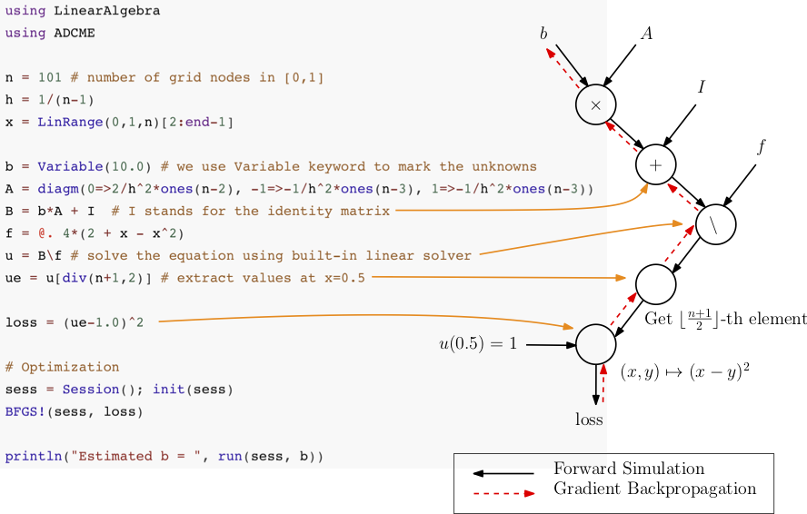

---


The ADCME library (**A**utomatic **D**ifferentiation Library for **C**omputational and **M**athematical **E**ngineering) aims at generic and scalable inverse modeling with gradient based optimization techniques. It has [TensorFlow](https://www.tensorflow.org/) as the automatic differentiation and parallel computing backends. The dataflow model adopted by the framework enables researchers to do high performance inverse modeling *without substantial effort after implementing the forward simulation*.

Several features of the library are

* *MATLAB-style syntax*. Write `A*B` for matrix production instead of `tf.matmul(A,B)`.
* *Custom operators*. Implement operators in C/C++ for bottleneck parts; incooporate legacy code or specially designed C/C++ code in `ADCME`.
* *Numerical Scheme*. Easy to implement numerical shemes for solving PDEs.
* *Static graphs*. Compilation time computational graph optimization; automatic parallelism for your simulation codes.
* *Custom optimizers*. Large scale constrained optimization? Use `CustomOptimizer` to integrate your favorate optimizer. 

Start building your forward and inverse modeling on top of the million-dollar [TensorFlow](https://www.tensorflow.org/) project with ADCME today!

| Documentation                                                |
| ------------------------------------------------------------ |
| [](https://kailaix.github.io/ADCME.jl/dev) |


# Installation

1. Install [Julia](https://julialang.org/)

2. Install `ADCME`
```
julia> ]
pkg> add ADCME
```

3. (Optional) Test `ADCME.jl`
```
julia> ]
pkg> test ADCME
```

4. (Optional) Test Custom Operator Functionality
If you want to use `customop()` and test the utility, test with the following command
```
julia> test_custom_op()
```
For custom operators, the TensorFlow shared library compiler (see [here](https://www.tensorflow.org/install/source#tested_build_configurations)) must be consistent with the compiler used for compiling custom operators. By default, `ADCME` installs Anaconda GCC on the Linux system. For custom version of TensorFlow, if you encounter problems with compiling, load error or link error, consider check GCC and `libtensorflow_framework.so` versions. The following information may be useful

| Variable      | Description                           |
| ------------- | ------------------------------------- |
| `ADCME.CXX`   | C++ Compiler                          |
| `ADCME.CC`    | C Compiler                            |
| `ADCME.TFLIB` | `libtensorflow_framework.so` location |
| `ADCME.CMAKE` | Cmake binary location                 |
| `ADCME.MAKE`  | Make binary location                  |

5. (Optional) Enable GPU Support
To enable GPU support, first make sure `nvcc` is available from your environment (e.g., type `nvcc` in your shell and you should get the location of the executable binary file).
```julia
using ADCME
enable_gpu()
```


# Tutorial

Consider solving the following problem

-bu''(x)+u(x) = f(x), x∈[0,1], u(0)=u(1)=0

where 

f(x) = 8 + 4x - 4x²

Assume that we have observed `u(0.5)=1`, we want to estimate `b`. The true value in this case should be `b=1`.

```julia
using LinearAlgebra
using ADCME

n = 101 # number of grid nodes in [0,1]
h = 1/(n-1)
x = LinRange(0,1,n)[2:end-1]

b = Variable(10.0) # we use Variable keyword to mark the unknowns
A = diagm(0=>2/h^2*ones(n-2), -1=>-1/h^2*ones(n-3), 1=>-1/h^2*ones(n-3)) 
B = b*A + I  # I stands for the identity matrix
f = @. 4*(2 + x - x^2) 
u = B\f # solve the equation using built-in linear solver
ue = u[div(n+1,2)] # extract values at x=0.5

loss = (ue-1.0)^2 

# Optimization
sess = Session(); init(sess) 
BFGS!(sess, loss)

println("Estimated b = ", run(sess, b))
```
Expected output 
```
Estimated b = 0.9995582304494237
```

The gradients can be obtained very easily. For example, if we want the gradients of `loss` with respect to `b`, the following code will create a Tensor for the gradient
```
julia> gradients(loss, b)
PyObject <tf.Tensor 'gradients_1/Mul_grad/Reshape:0' shape=() dtype=float64>
```

Under the hood, a computational graph is created for gradients back-propagation.




For more documentation, see [here](https://kailaix.github.io/ADCME.jl/dev).

# Research Work

Click the images for short descriptions!

[1] Kailai Xu, and Eric Darve. "[Adversarial Numerical Analysis for Inverse Problems](https://arxiv.org/abs/1910.06936)"

[](https://kailaix.github.io/ADCME.jl/dev/apps_ana/)

[2] Kailai Xu and Eric Darve. "[Calibrating Multivariate Lévy Processes with Neural Networks](https://arxiv.org/abs/1812.08883)"

[](https://kailaix.github.io/ADCME.jl/dev/apps_levy/)


[3] Kailai Xu (**co-first author**), Huang, Daniel Z. (**co-first author**), Charbel Farhat, and Eric Darve. "[Learning Constitutive Relations from Indirect Observations Using Deep Neural Networks](https://arxiv.org/abs/1905.12530)"

[](https://kailaix.github.io/ADCME.jl/dev/apps_constitutive_law/)


# LICENSE

ADCME.jl is released under GNU GENERAL PUBLIC LICENSE Version 3. See [License](https://github.com/kailaix/ADCME.jl/tree/master/LICENSE) for details. 
