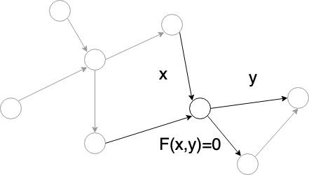

# Forward Operator Types

All numerical simulations can be decomposed into operators that are chained together. These operators range from a simple arithmetic operation such as addition or multiplication, to more sophisticated computation such as solving a linear system. Automatic differentiation relies on the differentiation of those operators and integrates them with chain rules. Therefore, it is very important for us to study the basic types of existing operators. 



In this tutorial, a operator is defined as a numerical procedure that accepts a parameter called *input*, $x$, and turns out a parameter called *ouput*, $y=f(x)$. For reverse mode automatic differentiation, besides evaluating $f(x)$, we need also to compute $\frac{\partial J}{\partial x}$ given $\frac{\partial J}{\partial y}$ where $J$ is a functional of $y$. 

Note  the operator $y=f(x)$ may be implicit in the sense that $f$ is not given directly. In general, we can write the relationship between $x$ and $y$ as $F(x,y)=0$. The operator is *well-defined* if for given $x$, there exists one and only one $y$ such that $F(x,y)=0$. 

For automatic differentiation, besides the well-definedness of $F$, we also require that we can compute $\frac{\partial J}{\partial x}$ given $\frac{\partial J}{\partial y}$. It is easy to see that
```math
\frac{\partial J}{\partial x} = -\frac{\partial J}{\partial y}F_y^{-1}F_x
```
Therefore, we call an operator $F$ is *well-posed* if $F_y^{-1}$ exists. 

All operators can be classified into four types based on the linearity and explicitness.

* **Linear and explicit**
  This type of operators has the form 
  ```math
  y = Ax
  ```
  where $A$ is a matrix. In this case, 
  ```math
  F(x,y) = Ax-y
  ```
  and therefore 
  ```math
  \frac{\partial J}{\partial x} = \frac{\partial J}{\partial y}A
  ```

  In Tensorflow, such an operator can be implemented as (assuming `A` is )

  ```python
  import tensorflow as tf
  @tf.custom_gradient
  def F(x):
      u = tf.linalg.matvec(A, x)
      def grad(dy):
          return tf.linalg.matvec(tf.transpose(A), dy)
      return u, grad
  ```

* **Nonlinear and explicit**
  In this case, we have 
  $$y = F(x)$$
  where $F$ is explicitly given. We have
  ```math
  F(x,y) = F(x)-y\Rightarrow \frac{\partial J}{\partial x} = \frac{\partial J}{\partial y} F_x(x)
  ```

  One challenge here is we need to implement the matrix vector production $\frac{\partial J}{\partial y} F_x(x)$ for `grad`. 

* **Linear and implicit**
  In this case 
  ```math
  Ay = x
  ```

  We have $F(x,y) = x-Ay$ and 
  ```math
  \frac{\partial J}{\partial x} = \frac{\partial J}{\partial y}A^{-1}
  ```

* **Nonlinear and implicit**
  In this case $F(x,y)=0$ and the corresponding gradient is 
  ```math
  \frac{\partial J}{\partial x} = -\frac{\partial J}{\partial y}F_y^{-1}F_x
  ```

  This case is the most challenging of the four but widely seen in scientific computing code. In many numerical simulation code, $F_y$ is usually sparse and therefore it is rewarding to exploit the sparse structure for computation acceleration in practice.