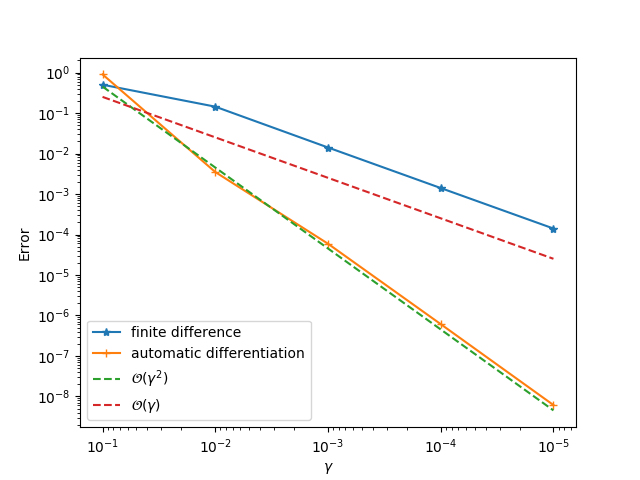

# Writing Custom Operators in `ADCME.jl`

## When do we need custom operators?

`TensorFlow` is a time-saver by eliminating the need to derive and implement the gradients manually, as long as one can implement and is satisfied with the forward simulation code. However, there are cases that refrain people from using `TensorFlow` as an automatic differentiation tool

* Efficient forward simulation in `TensorFlow` may require people to implement vectorized codes. This is not always the case in engineering, e.g., boundary conditions, flux conditions, etc. 

* Some modules require expertise from scientific computing to achieve high efficiency, such as the application of algebraic multigrid method, etc. 

* In principal, one can only implement explicit operators with `TensorFlow` APIs directly. By "explicit", we mean that the operator is like 
  $$
  \mathrm{output} = f(\mathrm{input})
  $$
  For operators such as 
  $$
  f(\mathrm{input},\mathrm{output}) = 0
  $$
  where $f$ is nonlinear in (both) operators, there is no general way to deal with. 

At some point, it is desirable for people to "intervene" the automatic differentiation mechanism. `TensorFlow` provides us a way to accomplish this goal — custom operators. 

## Custom operators in `ADCME`

Readers should consult the [official website](https://tensorflow.google.cn/guide/extend/op) for writing C++ operators for `TensorFlow`. Here we introduce an end-to-end API in `ADCME` for this kind of task. For concreteness, we consider implementing a custom operator for solving sparse linear system.

**Input**: row vector `ii`, column vector`jj` and value vector `vv` for the sparse coefficient matrix; row vector `kk` and value vector `ff`, matrix dimension $d$

**Output**: solution vector $u$

The creation of custom operators is split into several steps,

1. **Create and modify the template file**

   Run the command in `julia` 

   ```julia
   customop()
   ```

   There will be a `custom_op.txt` in the current directory. Modify the template file 

   ```txt
   SparseSolver
   int32 ii(?)
   int32 jj(?)
   double vv(?)
   int32 kk(?)
   double ff(?)
   int32 d()
   double u(?) -> output
   ```

2. **Implement core codes**

   Run `customop()` again and there will be `CMakeLists.txt`, `gradtest.jl`, `SparseSolver.cpp` appearing in the current directory. `SparseSolver.cpp` is the main wrapper for the codes and `gradtest.jl` is used for testing the operator and its gradients. `CMakeLists.txt` is the file for compilation. 

   Create a new file `SparseSolver.h` and implement both the forward simulation and backward simulation (gradients)

   ```cpp
   #include <eigen3/Eigen/Sparse>
   #include <eigen3/Eigen/SparseLU>
   #include <vector>
   #include <iostream>
   using namespace std;
   typedef Eigen::SparseMatrix<double> SpMat; // declares a column-major sparse matrix type of double
   typedef Eigen::Triplet<double> T;
   
   SpMat A;
   
   void forward(double *u, const int *ii, const int *jj, const double *vv, int nv, const int *kk, const double *ff,int nf,  int d){
       vector<T> triplets;
       Eigen::VectorXd rhs(d); rhs.setZero();
       for(int i=0;i<nv;i++){
         triplets.push_back(T(ii[i]-1,jj[i]-1,vv[i]));
       }
       for(int i=0;i<nf;i++){
         rhs[kk[i]-1] += ff[i];
       }
       A.resize(d, d);
       A.setFromTriplets(triplets.begin(), triplets.end());
       auto C = Eigen::MatrixXd(A);
       Eigen::SparseLU<SpMat> solver;
       solver.analyzePattern(A);
       solver.factorize(A);
       auto x = solver.solve(rhs);
       for(int i=0;i<d;i++) u[i] = x[i];
   }
   
   void backward(double *grad_vv, const double *grad_u, const int *ii, const int *jj, const double *u, int nv, int d){
       Eigen::VectorXd g(d);
       for(int i=0;i<d;i++) g[i] = grad_u[i];
       auto B = A.transpose();
       Eigen::SparseLU<SpMat> solver;
       solver.analyzePattern(B);
       solver.factorize(B);
       auto x = solver.solve(g);
       // cout << x << endl;
       for(int i=0;i<nv;i++) grad_vv[i] = 0.0;
       for(int i=0;i<nv;i++){
         grad_vv[i] -= x[ii[i]-1]*u[jj[i]-1];
       }
   }
   ```

   

   In this implementation I have used `Eigen` library for solving sparse matrix. Other choices are also possible, such as algebraic multigrid methods. 

3. **Compile**

   Simply run the following command

   ```bash
   mkdir build
   cd build
   cmake ..
   make -j
   ```

   Based on your operation system, you will create `libSparseSolver.{so,dylib,dll}`. This will be the dynamic library to link in `TensorFlow`. 

4. **Test**

   Finally, you could use `gradtest.jl` to test the operator and its gradients. If you implement the gradients correctly, you will be able to obtain first order convergence for finite difference and second order convergence for automatic differentiation.

   

Whenever you want to use `sparse_solver` as a `TensorFlow` operator, copy the corresponding driver codes in `gradtest.jl` (with necessary modification of paths) to your working file. 